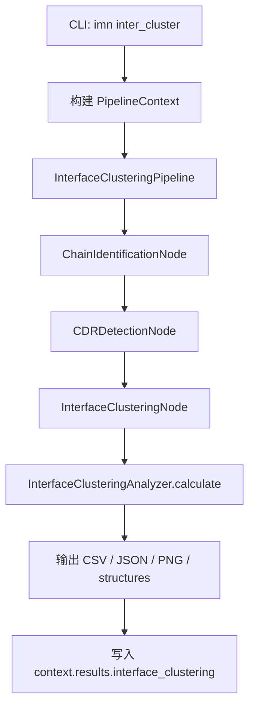
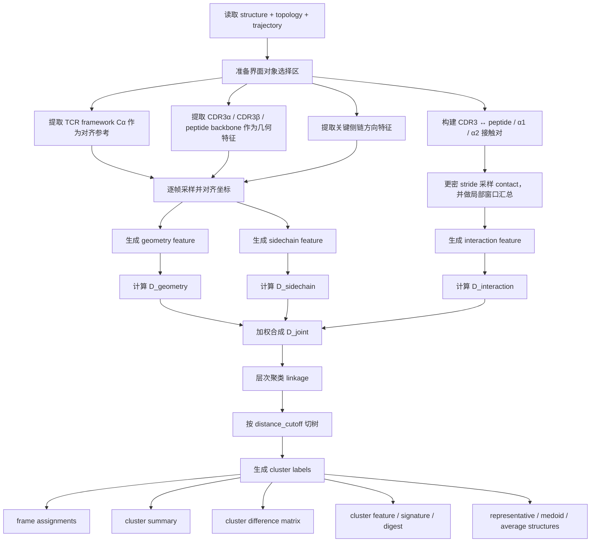

# Interface Clustering 模块流程图

本文档描述当前 `inter_cluster` / `InterfaceClusteringPipeline` 的真实执行流程。  
目标是让开发者和后续前端/报告层能够快速理解：

- 输入是什么
- 中间做了哪些特征构建
- 聚类如何完成
- 输出产物有哪些

对应主实现：
- [inter_cluster.py](/home/xumy/work/development/Immunex/immunex/cli/commands/inter_cluster.py)
- [analysis_pipelines.py](/home/xumy/work/development/Immunex/immunex/pipeline/analysis_pipelines.py)
- [interface_clustering_node.py](/home/xumy/work/development/Immunex/immunex/pipeline/nodes/interface/interface_clustering_node.py)
- [interface_clustering.py](/home/xumy/work/development/Immunex/immunex/analysis/conformation/interface_clustering.py)

---

## 1. 高层流程图

---

## 2. 真实执行流程

### Step 1：CLI 收集输入

CLI 接收：

- `--trajectory`
- `--topology`
- `--structure`
- `--output`
- `--stride`
- `--contact-cutoff`
- `--distance-cutoff`
- `--linkage-method`
- `--geometry-weight`
- `--sidechain-weight`
- `--interaction-weight`

然后组装 `PipelineContext`。

---

### Step 2：前置语义节点

在进入聚类前，pipeline 会先执行两个前置节点：

1. `ChainIdentificationNode`
   - 识别：
     - `mhc_alpha`
     - `b2m`
     - `peptide`
     - `tcr_alpha`
     - `tcr_beta`
   - 产出：
     - `context.metadata["chain_mapping"]`

2. `CDRDetectionNode`
   - 检测：
     - `CDR1`
     - `CDR2`
     - `CDR3`
   - 当前聚类直接依赖：
     - `CDR3α`
     - `CDR3β`
   - 产出：
     - `context.metadata["cdr_detection"]`

这两步的作用是让聚类模块不需要盲猜链和区域。

---

## 3. 聚类主算法流程图

---

## 4. 特征层怎么构建

### 4.1 几何特征 `geometry`

几何主特征取自：

- `CDR3α`
- `CDR3β`
- `peptide`

所使用的是：

- `backbone heavy atoms`

作用：
- 描述关键界面的主链骨架构型

---

### 4.2 侧链特征 `sidechain`

当前不是用 `χ1/χ2`，而是用更稳的近似：

- `CA -> sidechain center of mass` 的单位方向向量

作用：
- 近似描述关键侧链总体朝向
- 捕捉：
  - 朝向 peptide
  - 朝向 α1/α2
  - 局部 side-chain reorientation

---

### 4.3 接触特征 `interaction`

当前是 residue-pair 粒度的 coarse contact fingerprint：

- 来源：
  - `CDR3α`
  - `CDR3β`
- 目标：
  - `peptide`
  - `alpha1 helix`
  - `alpha2 helix`

每个 pair 是：

- `0/1` 接触状态

判断规则：

- 最小重原子距离 `<= contact_cutoff_angstrom`

当前不是直接用几何 stride，而是：

- `contact_stride = ceil(stride / 2)`
- 再围绕几何帧做局部窗口汇总

这一步的目的是：
- 让 contact 比 geometry 更敏感
- 但避免单帧接触开关噪声直接切碎 cluster

---

## 5. 联合距离

三类特征分别计算距离矩阵：

- `D_geometry`
- `D_sidechain`
- `D_interaction`

然后按权重合成：

\[
D_{joint} = w_g D_{geometry} + w_s D_{sidechain} + w_i D_{interaction}
\]

默认权重：

- `geometry_weight = 0.45`
- `sidechain_weight = 0.25`
- `interaction_weight = 0.30`

这意味着当前聚类是：

- 几何为主
- 侧链为辅
- interaction 作为功能约束

---

## 6. 聚类方式

当前使用：

- `scipy.cluster.hierarchy.linkage`
- `fcluster(..., criterion="distance")`

也就是：

1. 先做层次聚类
2. 再按 `distance_cutoff` 切树

当前并不是：

- 预先指定固定 `k`

所以 cluster 数量主要受：

- 特征分布
- `distance_cutoff`
- `stride`

共同影响。

---

## 7. 输出产物

当前 `InterfaceClusteringNode` 会产出这些核心文件：

### 7.1 表格

- `frame_cluster_assignments.csv`
- `summary_table.csv`
- `cluster_difference_matrix.csv`
- `cluster_feature_summary.csv`
- `cluster_specific_signatures.csv`
- `cluster_feature_digest.csv`

### 7.2 摘要

- `interface_clustering_summary.json`

### 7.3 时间图

- `cluster_id_vs_time.png`
- `state_population_over_time.png`

### 7.4 构象文件

- `structures/cluster_X_representative.pdb`
- `structures/cluster_X_medoid.pdb`
- `structures/cluster_X_average.pdb`

---

## 8. 结果层的解释逻辑

当前 cluster 输出分成四层：

### 8.1 Summary table

回答：
- 有几个 cluster
- 各自占比多少
- 首次出现时间
- 平均驻留时间
- 代表帧 / medoid 帧是什么

### 8.2 Representative structures

回答：
- 每个 cluster 的代表构象是什么

### 8.3 Time evolution

回答：
- cluster 如何随时间切换
- 状态占比是否稳定

### 8.4 Difference explanation

回答：
- cluster 和 cluster 之间到底差在哪里
- 哪些 residue pair 是某个状态的 signature

---

## 9. 一句话总结

当前 `inter_cluster` 的真实设计不是“只做 RMSD 聚类”，而是：

**围绕 `CDR3α/β + peptide + MHC groove` 关键界面，联合 backbone 几何、侧链朝向和 coarse contact pattern 三类特征，对轨迹中的界面状态做层次聚类，并输出状态占比、代表构象、时间演化和簇特异性界面 signature。**

